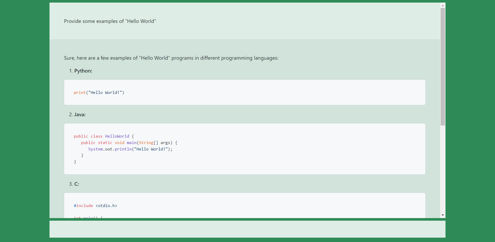

单文件ChatGPT客户端。支持Markdown，支持代码高亮。流模式启用。

在源码中写入你的API_KEY即可开始使用。无需部署服务器，浏览器直接打开就行。

This is a demo of a single-file ChatGPT client. Supports Markdown and code highlighting, `stream` enabled.

Write your API_KEY in the source code to start using. There is no need to deploy the webpage to the server, just open it directly with a browser.

